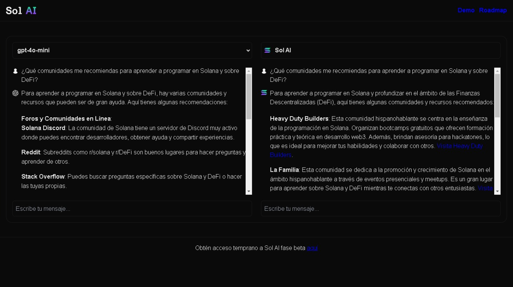

  
  
  <h1>Sol AI - Solana Copa America</h1>
  
  <h3>Asistente de IA especializado en Solana</h3>

Este sitio web es una demostración del primer asistente de inteligencia artificial especializado en Solana. A la izquierda, podrás hacer preguntas a modelos de IA como Gemini o Chat-GPT, mientras que a la derecha podrás consultar a **Sol AI** para comparar información actual sobre el ecosistema de Solana.

El sitio se conecta a la [API de Sol AI](https://github.com/leandrogavidia/sol-ai-api), que proporciona el contexto necesario para responder a las preguntas a través de una documentación estructurada de código abierto.

## Getting Started

1. `git clone`
2. `npm i`
3. `npm run dev`
