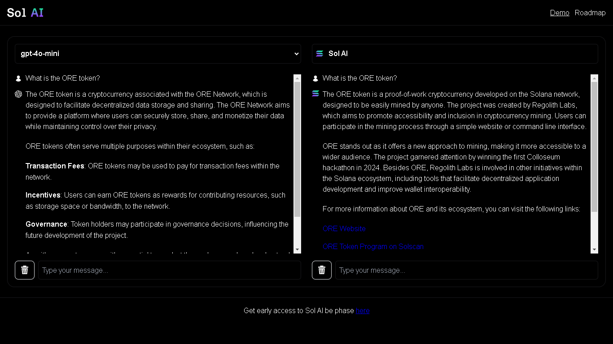

  
  
  <h1>Sol AI - Solana Copa America</h1>
  
  <h3>AI-powered solana virtual assistant</h3>

This website is a demonstration of the first artificial intelligence assistant specialized in Solana. On the left, you can ask questions to AI models like Gemini or Chat-GPT, while on the right you can consult **Sol AI** to compare current information about the Solana ecosystem.

The site connects to the [**Sol AI API**](https://github.com/leandrogavidia/sol-ai-api), which provides the necessary context to answer questions through structured open-source documentation.

## Getting Started

1. `git clone`
2. `npm i`
3. create a `.env` file with the following env variables:
    - `OPENAI_API_KEY`
    - `GOOGLE_GENERATIVE_AI_API_KEY`
3. `npm run dev`
